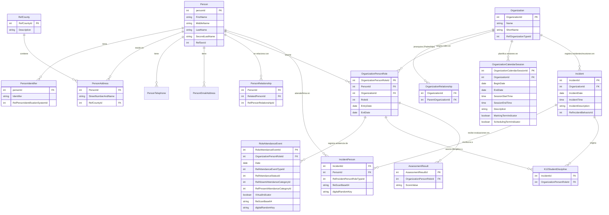

# Edugest
Prototipo escalar de sistema de  gestión  para establecimientos educativos


## Estructura de sistema de gestion educacional
### Modulos
libro de clases digital:

- registro de asistencia diaria y por clase
- registro de leccionario vinculado a la planificación curricular
- registro de calificaciones formativas y sumativas 
- generación automática de certificados e informes académicos
- panel de seguimiento académico por curso, docente  y asignatura
- panel de riesgo académico o riesgo repitencia de estudiantes


Evaluaciones:

- permitir creación de instrumentos de evaluación digitales
- incluir banco de preguntas asociado a objetivos de aprendizaje
- permitir aplicar evaluaciones digitales o registrar evaluaciones aplicadas a papel
- generar  resultados automáticos por estudiante y curso
- permitir analisis de resultados


Biblioteca escolar:

- permitir gestión de catalogo bibliográfico del establecimiento , incluyendo registro de prestamos', devoluciones y reportes de uso

Comunicacion con apoderados:

- permitir comunicacion bidireccional entre profesores y apoderados, a traves de un chat interno del sistema y el envio de correos
- permitir ver los anuncios y noticias publicadas por los profesores

## Requisitos de funcionalidad por roles
administrador
```
1. es quien maneja los permisos para el resto de usuarios (0=no acceso, 1=solo puede leer y ver info, 2=puede leer y escribir)

2. debe contar con un panel tipo checkbox, donde el seleccione que modulos, y que funcionalidades tiene disponible el sistema

3. ser capaz de modificar credeciales de acceso de el resto de usuarios

4. crear y  registrar usuarios, asignado rol y nivel de permisos(permitir carga masiva de usuarios, exportar excel con registro de usuarios)

5. crear roles(se permite crear un nuevo rol, especificando a que funcionalidades de cada modulo tiene acceso)

6. por cada usuario de rol profesor, designar asignatura que impartira(puede impartir una o mas asignaturas)

7. cada usuario rol alumno, designar a que curso corresponde (desde 1° basico hasta 4° medio)

8. debe poder crear anucios en un panel de anuncios y noticias
```

profesor
```
1. es quien tiene nivel de permiso 2 en todos los modulos disponibles

2. al entrar en el sistema vera todas las asignatura que el impartira, por curso, despues selecciona  una asignatura se redirije a esa 
   asignatura y se le pregunta la cantidad de unidades a crear, debe tener un boton que le permita agregar otra unidad

3. al tener unidades ya creadas, esta la opcion de crear un cuestionario, o subir info estatica tipo guia o ppt informativo

4. la opcion de crear cuestionarios(son preguntas de alternativas o verdadero y falso las cuales ya tienen una respuesta correcta definida)

5. la opcion de crear pruebas se permite 3 tipos de preguntas(alternativa,verdadero o falso, desarrollo)

6. cada item unidad, prueba , debe tener un checkbox que indique si es visible para el estudiante o no

7. debe poder crear anucios en un panel de anuncios y noticias
```

estudiante
```
1. tiene nivel de acceso 1 a cada modulo, en su mayoria solo puede leer la info y descargarla 
```

apoderado
```
1. Tiene acceso a info especifica del estudiante tales como(registro de notas por curso,registro de asistencia(mensual, por clases del dia), 
calendario con fechas importantes, lista de contactos de profesores(correos y telefonos))
```


# Mapeado de la base de datos mineduc

