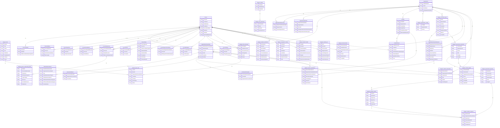

```mermaid
erDiagram
    Person {
        string PersonId
        string FirstName
        string MiddleName
        string LastName
        string SecondLastName
        string RefSexId
        string Birthdate
        string RefTribalAffiliationId
    }
    Organization {
        string OrganizationId
        string Name
        string ShortName
        string RefOrganizationTypeId
    }
    edugest_module {
        string ModuleId
        string ModuleName
        string IsEnabled
    }
    edugest_book {
        string BookId
        string Title
        string Author
        string Isbn
        string TotalStock
        string AvailableStock
        string IsVirtual
        string FileUrl
    }
    PersonIdentifier {
        string PersonId
        string Identifier
        string RefPersonIdentificationSystemId
    }
    OrganizationRelationship {
        string OrganizationRelationshipId
        string OrganizationId
        string ParentOrganizationId
    }
    OrganizationIdentifier {
        string OrganizationIdentifierId
        string OrganizationId
        string Identifier
        string RefOrganizationIdentificationSystemId
        string RefOrganizationIdentifierTypeId
    }
    OrganizationPersonRole {
        string OrganizationPersonRoleId
        string OrganizationId
        string PersonId
        string RoleId
        string EntryDate
        string ExitDate
    }
    Incident {
        string IncidentId
        string OrganizationId
        string IncidentDate
        string IncidentTime
        string IncidentDescription
        string RefIncidentBehaviorId
    }
    PersonAddress {
        string PersonAddressId
        string PersonId
        string StreetNumberAndName
        string RefCountyId
    }
    PersonTelephone {
        string PersonTelephoneId
        string PersonId
        string TelephoneNumber
    }
    PersonEmailAddress {
        string PersonEmailAddressId
        string PersonId
        string EmailAddress
    }
    PersonRelationship {
        string PersonRelationshipId
        string PersonId
        string RelatedPersonId
        string RefPersonRelationshipId
    }
    PersonHealth {
        string PersonHealthId
        string PersonId
        string Description
    }
    PersonStatus {
        string PersonStatusId
        string PersonId
        string RefPersonStatusTypeId
        string StatusStartDate
        string StatusEndDate
        string Description
        string docNumber
        string fileScanBase64
    }
    PersonDegreeOrCertificate {
        string PersonDegreeOrCertificateId
        string PersonId
        string RefDegreeOrCertificateTypeId
    }
    PersonBirthplace {
        string PersonBirthplaceId
        string PersonId
        string RefCountryId
    }
    PersonAllergy {
        string PersonAllergyId
        string PersonId
        string AllergyDescription
    }
    edugest_role_permission {
        string PermissionId
        string RoleId
        string ModuleId
        string PermissionLevel
    }
    edugest_organization_config {
        string ConfigId
        string OrganizationId
        string IsActive
    }
    edugest_curriculum_plan {
        string PlanId
        string OrganizationId
        string UnitTitle
        string Contenido
        string Actividad
        string DetallesActividad
        string Objetivo
        string CreatedAt
    }
    edugest_chat_message {
        string MessageId
        string SenderPersonId
        string ReceiverPersonId
        string MessageText
        string SentAt
        string IsRead
    }
    edugest_announcement {
        string AnnouncementId
        string SenderPersonId
        string TargetOrganizationId
        string Title
        string Content
        string AttachmentUrl
        string CreatedAt
    }
    edugest_student_enrollment {
        string EnrollmentId
        string PersonId
        string Nacionalidad
        string PaisOrigen
        string ComunaResidencia
        string RegionResidencia
        string EmailEstudiante
        string TelefonoEstudiante
    }
    edugest_emergency_contact {
        string ContactId
        string PersonId
        string Orden
        string FirstName
        string LastName
        string SecondLastName
        string NombreCompleto
        string RUN
    }
    edugest_student_health {
        string HealthId
        string PersonId
        string GrupoSanguineo
        string SistemaSalud
        string EnfermedadesPermanentes
        string Alergias
        string MedicamentosPermanentes
        string RestriccionesAlimentarias
    }
    edugest_student_pie {
        string PieId
        string PersonId
        string PertenecePIE
        string DiagnosticoPIE
        string FechaDiagnostico
        string ProfesionalTratante
        string ObservacionesPIE
        string TipoPermanencia
    }
    RoleAttendanceEvent {
        string RoleAttendanceEventId
        string OrganizationPersonRoleId
        string Date
        string RefAttendanceEventTypeId
        string RefAttendanceStatusId
        string RefAbsentAttendanceCategoryId
        string RefPresentAttendanceCategoryId
        string VirtualIndicator
    }
    OrganizationCalendarSession {
        string OrganizationCalendarSessionId
        string OrganizationId
        string BeginDate
        string EndDate
        string SessionStartTime
        string SessionEndTime
        string Description
        string MarkingTermIndicator
    }
    AssessmentResult {
        string AssessmentResultId
        string OrganizationPersonRoleId
        string ScoreValue
    }
    IncidentPerson {
        string IncidentPersonId
        string IncidentId
        string PersonId
        string RefIncidentPersonRoleTypeId
        string fileScanBase64
        string digitalRandomKey
        string Date
    }
    K12StudentDiscipline {
        string K12StudentDisciplineId
        string IncidentId
        string OrganizationPersonRoleId
    }
    edugest_student_observation {
        string ObservationId
        string OrganizationPersonRoleId
        string AsignaturaId
        string Tipo
        string Detalle
        string FechaRegistro
    }
    edugest_assessment_instrument {
        string InstrumentId
        string OrganizationId
        string PlanId
        string Title
        string IsDigital
        string IsVisible
    }
    edugest_book_loan {
        string LoanId
        string BookId
        string OrganizationPersonRoleId
        string LoanDate
        string DueDate
        string ReturnDate
        string Status
    }
    edugest_person_relationship_detail {
        string DetailId
        string PersonRelationshipId
        string Parentesco
        string ProfesionOcupacion
        string LugarTrabajo
        string Direccion
        string CorreoElectronico
        string EstadoCivil
    }
    edugest_session_attendance {
        string SessionAttendanceId
        string OrganizationCalendarSessionId
        string OrganizationPersonRoleId
        string AttendanceStatusId
        string FechaRegistro
        string HoraInicio
        string HoraTermino
    }
    edugest_assessment_question {
        string QuestionId
        string InstrumentId
        string QuestionText
        string QuestionType
        string Points
        string ImageUrl
    }
    edugest_manual_grade {
        string ManualGradeId
        string InstrumentId
        string OrganizationPersonRoleId
        string Score
        string IsManual
        string CreatedAt
        string UpdatedAt
    }
    edugest_question_option {
        string OptionId
        string QuestionId
        string OptionText
        string MatchText
        string IsCorrect
        string OrderIndex
    }
    edugest_student_response {
        string ResponseId
        string OrganizationPersonRoleId
        string QuestionId
        string SelectedOptionId
        string TextResponse
        string ScoreEarned
    }
    Person ||--o{ PersonIdentifier : FK
    Organization ||--o{ OrganizationRelationship : FK
    Organization ||--o{ OrganizationRelationship : FK
    Organization ||--o{ OrganizationIdentifier : FK
    Person ||--o{ OrganizationPersonRole : FK
    Organization ||--o{ OrganizationPersonRole : FK
    Organization ||--o{ Incident : FK
    Person ||--o{ PersonAddress : FK
    Person ||--o{ PersonTelephone : FK
    Person ||--o{ PersonEmailAddress : FK
    Person ||--o{ PersonRelationship : FK
    Person ||--o{ PersonRelationship : FK
    Person ||--o{ PersonHealth : FK
    Person ||--o{ PersonStatus : FK
    Person ||--o{ PersonDegreeOrCertificate : FK
    Person ||--o{ PersonBirthplace : FK
    Person ||--o{ PersonAllergy : FK
    edugest_module ||--o{ edugest_role_permission : FK
    Organization ||--o{ edugest_organization_config : FK
    Organization ||--o{ edugest_curriculum_plan : FK
    Person ||--o{ edugest_chat_message : FK
    Person ||--o{ edugest_chat_message : FK
    Organization ||--o{ edugest_announcement : FK
    Person ||--o{ edugest_announcement : FK
    Person ||--o{ edugest_student_enrollment : FK
    Person ||--o{ edugest_emergency_contact : FK
    Person ||--o{ edugest_student_health : FK
    Person ||--o{ edugest_student_pie : FK
    OrganizationPersonRole ||--o{ RoleAttendanceEvent : FK
    edugest_curriculum_plan ||--o{ OrganizationCalendarSession : FK
    Organization ||--o{ OrganizationCalendarSession : FK
    OrganizationPersonRole ||--o{ AssessmentResult : FK
    Person ||--o{ IncidentPerson : FK
    Incident ||--o{ IncidentPerson : FK
    OrganizationPersonRole ||--o{ K12StudentDiscipline : FK
    Incident ||--o{ K12StudentDiscipline : FK
    Organization ||--o{ edugest_student_observation : FK
    OrganizationPersonRole ||--o{ edugest_student_observation : FK
    edugest_curriculum_plan ||--o{ edugest_assessment_instrument : FK
    Organization ||--o{ edugest_assessment_instrument : FK
    OrganizationPersonRole ||--o{ edugest_book_loan : FK
    edugest_book ||--o{ edugest_book_loan : FK
    PersonRelationship ||--o{ edugest_person_relationship_detail : FK
    OrganizationPersonRole ||--o{ edugest_session_attendance : FK
    OrganizationCalendarSession ||--o{ edugest_session_attendance : FK
    edugest_assessment_instrument ||--o{ edugest_assessment_question : FK
    OrganizationPersonRole ||--o{ edugest_manual_grade : FK
    edugest_assessment_instrument ||--o{ edugest_manual_grade : FK
    edugest_assessment_question ||--o{ edugest_question_option : FK
    edugest_question_option ||--o{ edugest_student_response : FK
    edugest_assessment_question ||--o{ edugest_student_response : FK
    OrganizationPersonRole ||--o{ edugest_student_response : FK
```