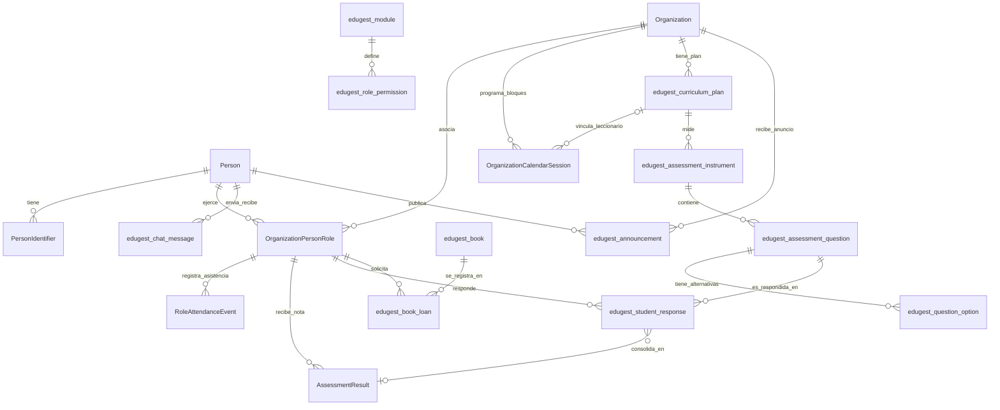

---

# 📋 Blueprint de Base de Datos: Edugest v1.0

Este documento contiene el modelo relacional extendido. Se divide en las **Tablas Base del Estándar MINEDUC (EDE)** y las **Tablas de Extensión de Edugest**.

## Bloque 1: Tablas Base Estándar MINEDUC (EDE)

*Estas tablas se implementan tal cual exige el gobierno de Chile, pero en Edugest se utilizarán para la lógica del Libro de Clases Digital.*

### 1. `Person` (Identidad Básica)

* `PersonId` (INT, PK): ID único global de la persona.
* `FirstName`, `MiddleName`, `LastName`, `SecondLastName` (VARCHAR): Nombres y apellidos.

### 2. `PersonIdentifier` (Documentos Oficiales)

* `PersonId` (INT, FK -> Person): Relación de identidad.
* `Identifier` (VARCHAR): El número de documento (RUT o IPE).
* `RefPersonIdentificationSystemId` (INT): Tipo de documento (`51` = RUT, `52` = IPE, `54` = Número de lista, `55` = Número correlativo matrícula).

### 3. `Organization` (Estructura Escolar)

* `OrganizationId` (INT, PK): ID de la entidad.
* `Name`, `ShortName` (VARCHAR): Nombres del establecimiento o curso.
* `RefOrganizationTypeId` (INT): Tipo de organización (`10` = Colegio/RBD, `21` = Curso/Nivel completo, `22` = Asignatura/Sección específica).

### 4. `OrganizationPersonRole` (Matrícula y Cargas Horarias)

* `OrganizationPersonRoleId` (INT, PK): Representa una relación específica (ej: Alumno X en el Curso Y).
* `OrganizationId` (INT, FK -> Organization)
* `PersonId` (INT, FK -> Person)
* `RoleId` (INT): Rol asignado (`6` = Estudiante, `17` = Tutor/Apoderado, `X` = Profesor).
* `EntryDate`, `ExitDate` (DATE): Fechas de vigencia (Matrícula/Retiro).

### 5. `RoleAttendanceEvent` (Asistencia Oficial)

* `RoleAttendanceEventId` (INT, PK): Registro de asistencia.
* `OrganizationPersonRoleId` (INT, FK -> OrganizationPersonRole): El estudiante evaluado.
* `Date` (DATE): Fecha del evento.
* `RefAttendanceEventTypeId` (INT), `RefAttendanceStatusId` (INT): Estados (`Presente`, `Ausente`, `Tarde`, `Virtual`).
* `fileScanBase64` (TEXT): Archivo justificativo si aplica.
* `digitalRandomKey` (VARCHAR): Token de la firma digital del docente.

### 6. `OrganizationCalendarSession` (Leccionario Oficial)

* `OrganizationCalendarSessionId` (INT, PK): El bloque horario/clase dictada.
* `OrganizationId` (INT, FK -> Organization): La Asignatura (Tipo 22).
* `BeginDate`, `EndDate`, `SessionStartTime`, `SessionEndTime` (DATETIME/TIME): Horarios exactos.
* `Description` (TEXT): **Aquí se guarda el contenido del Leccionario**.
* `MarkingTermIndicator` (BOOLEAN): Indica si se tomó asistencia en este bloque.
* `SchedulingTermIndicator` (BOOLEAN): Indica si hubo evaluación en este bloque.

### 7. `AssessmentResult` (Acta de Calificaciones)

* `AssessmentResultId` (INT, PK): Registro de la nota final.
* `OrganizationPersonRoleId` (INT, FK -> OrganizationPersonRole): El estudiante.
* `ScoreValue` (VARCHAR): La nota oficial (ej: "6.5" o "Formativo").

### 8. `Incident`, `IncidentPerson` y `K12StudentDiscipline` (Anotaciones)

* Manejan las observaciones de comportamiento (positivas/negativas), citaciones y firmas de las reuniones de apoderados utilizando `RefIncidentBehaviorId` para clasificar el tipo de evento.

---

## Bloque 2: Tablas de Extensión de Edugest (Campos Extras Requeridos)

*Estas tablas deben crearse desde cero para dotar al sistema de la interactividad, almacenamiento de datos dinámicos y paneles de control solicitados en el README.*

### Módulo A: Configuración y Matriz de Permisos (Administrador)

Permite al Administrador activar módulos globales y definir accesos granulares por rol (`0` = No acceso, `1` = Lectura, `2` = Escritura).

#### 9. `edugest_module` (Catálogo de Módulos)

* `ModuleId` (INT, PK, AutoIncrement)
* `ModuleName` (VARCHAR): Nombre de la funcionalidad (`'Libro Digital'`, `'Evaluaciones'`, `'Biblioteca'`, `'Comunicación'`).
* `IsEnabled` (BOOLEAN): Estado global controlado por el panel de checkboxes del Admin.

#### 10. `edugest_role_permission` (Matriz de Accesos)

* `PermissionId` (INT, PK, AutoIncrement)
* `RoleId` (INT): Código de rol que hace match con el `RoleId` de la tabla MINEDUC.
* `ModuleId` (INT, FK -> edugest_module)
* `PermissionLevel` (INT): Nivel de acceso restringido (`0`, `1`, `2`).

### Módulo B: Planificación Curricular Avanzada (Profesor / Libro Digital)

El MINEDUC solo pide registrar qué se hizo (`OrganizationCalendarSession`). Esta tabla permite al profesor planificar el año y vincular los bloques a objetivos de aprendizaje reales.

#### 11. `edugest_curriculum_plan` (Planificaciones)

* `PlanId` (INT, PK, AutoIncrement)
* `OrganizationId` (INT, FK -> Organization): La asignatura asociada (Tipo 22).
* `UnitTitle` (VARCHAR): Título de la unidad pedagógica.
* `LearningObjectives` (TEXT): Objetivos pedagógicos de la unidad.
* `EstimatedClasses` (INT): Cantidad de bloques estimados.

*Nota de integración:* Para cumplir con el requisito de "Leccionario vinculado a la planificación", debes agregar el campo `PlanId` (FK, Nullable) a la tabla estándar `OrganizationCalendarSession`.

### Módulo C: Motor de Evaluaciones e Instrumentos Digitales

Tablas requeridas para soportar el banco de preguntas, cuestionarios multimedia interactivos, almacenamiento de alternativas y flujos de corrección automática.

#### 12. `edugest_assessment_instrument` (Cabecera de Evaluación)

* `InstrumentId` (INT, PK, AutoIncrement)
* `PlanId` (INT, FK -> edugest_curriculum_plan): Unidad curricular que evalúa.
* `Title` (VARCHAR): Nombre de la prueba o taller.
* `IsDigital` (BOOLEAN): `True` si se rinde en la plataforma; `False` si fue impresa/papel.
* `IsVisible` (BOOLEAN): Controla si los alumnos pueden ver la nota o rendir el test.

#### 13. `edugest_assessment_question` (Banco de Preguntas)

* `QuestionId` (INT, PK, AutoIncrement)
* `InstrumentId` (INT, FK -> edugest_assessment_instrument)
* `QuestionText` (TEXT): Enunciado de la pregunta.
* `QuestionType` (VARCHAR): Clasificación (`'Alternativa'`, `'Verdadero/Falso'`, `'Desarrollo'`).
* `Points` (INT): Puntaje asignado a la pregunta.

#### 14. `edugest_question_option` (Opciones para Alternativas)

* `OptionId` (INT, PK, AutoIncrement)
* `QuestionId` (INT, FK -> edugest_assessment_question)
* `OptionText` (VARCHAR): Texto de la alternativa (ej: "A) Chile").
* `IsCorrect` (BOOLEAN): Identifica si esta es la respuesta correcta para el algoritmo de auto-corrección.

#### 15. `edugest_student_response` (Respuestas del Alumno)

* `ResponseId` (INT, PK, AutoIncrement)
* `OrganizationPersonRoleId` (INT, FK -> OrganizationPersonRole): ID del Alumno.
* `QuestionId` (INT, FK -> edugest_assessment_question)
* `SelectedOptionId` (INT, FK -> edugest_question_option, Nullable): Qué marco (si es alternativa).
* `TextResponse` (TEXT, Nullable): Lo que escribió (si es desarrollo).
* `ScoreEarned` (DECIMAL, Nullable): Puntaje obtenido tras la corrección.

*Nota de flujo:* Cuando todas las `edugest_student_response` de una prueba se califican, el backend procesa el puntaje total, calcula la nota final y la inserta automáticamente en la tabla oficial del MINEDUC `AssessmentResult`.

### Módulo D: Control de Biblioteca Escolar e Inventario (CRA)

Tablas dedicadas a administrar el catálogo de los 1.500 libros físicos/virtuales, controlar el stock disponible en tiempo real y trazar las devoluciones.

#### 16. `edugest_book` (Catálogo Bibliográfico)

* `BookId` (INT, PK, AutoIncrement)
* `Title` (VARCHAR): Título del libro.
* `Author` (VARCHAR): Autor del libro.
* `Isbn` (VARCHAR, Unique): Código estándar internacional.
* `TotalStock` (INT): Cantidad total comprada por el colegio.
* `AvailableStock` (INT): Unidades en estantería listas para préstamo.
* `IsVirtual` (BOOLEAN): `True` si es un e-book descargable; `False` si es físico.
* `FileUrl` (VARCHAR, Nullable): Ruta de descarga si el libro es digital.

#### 17. `edugest_book_loan` (Registro de Préstamos)

* `LoanId` (INT, PK, AutoIncrement)
* `BookId` (INT, FK -> edugest_book)
* `OrganizationPersonRoleId` (INT, FK -> OrganizationPersonRole): Quién pide el libro (Alumno o Profesor).
* `LoanDate` (DATE): Fecha de salida.
* `DueDate` (DATE): Fecha límite de devolución acordada.
* `ReturnDate` (DATE, Nullable): Fecha en que se devolvió físicamente.
* `Status` (VARCHAR): Estado del préstamo (`'Prestado'`, `'Devuelto'`, `'Atrasado'`).

### Módulo E: Comunicaciones y Comunidad Educativa

Tablas operativas dinámicas para habilitar mensajería instantánea interna y un muro centralizado de comunicados oficiales.

#### 18. `edugest_chat_message` (Chat Interno)

* `MessageId` (INT, PK, AutoIncrement)
* `SenderPersonId` (INT, FK -> Person): Persona que envía.
* `ReceiverPersonId` (INT, FK -> Person): Persona que recibe.
* `MessageText` (TEXT): Contenido del mensaje.
* `SentAt` (DATETIME): Marca de tiempo del mensaje.
* `IsRead` (BOOLEAN): Control de estado para notificaciones en tiempo real.

#### 19. `edugest_announcement` (Tablón de Anuncios / Diario Mural)

* `AnnouncementId` (INT, PK, AutoIncrement)
* `SenderPersonId` (INT, FK -> Person): Profesor o Administrador que publica.
* `TargetOrganizationId` (INT, FK -> Organization, Nullable): Si se dirige a un curso/asignatura específica. Si es `Null`, el anuncio es global para todo el establecimiento.
* `Title` (VARCHAR): Titular de la noticia.
* `Content` (TEXT): Cuerpo del anuncio.
* `AttachmentUrl` (VARCHAR, Nullable): Enlace a circulares en PDF o imágenes adjuntas.
* `CreatedAt` (DATETIME)

---

# 🗺️ Diagrama de Relaciones Arquitectónicas (Mermaid)

Este mapa muestra de forma exacta cómo interactúa el ecosistema nativo del gobierno con las extensiones comerciales de tu plataforma. Puedes copiarlo y pegarlo en tu visor:

---
